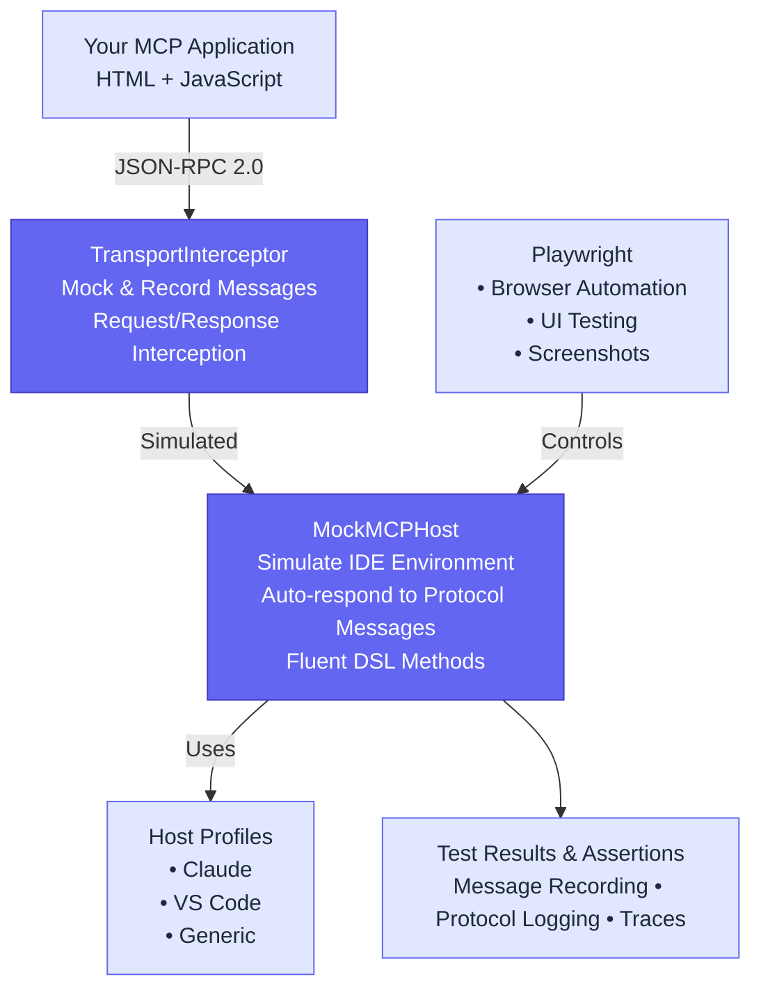

# mcp-apps-testing

[](https://www.npmjs.com/package/mcp-apps-testing)
[](https://www.npmjs.com/package/mcp-apps-testing)
[](https://opensource.org/licenses/MIT)
[](https://nodejs.org)
[](https://www.typescriptlang.org/)

mcp-apps-testing is a testing framework for MCP Apps external UI (ext-apps). It validates the full lifecycle of UI components returned by MCP tools — from tool response metadata, through client UI loading, to runtime widget behavior and host communication. Unlike generic MCP testing libraries, it focuses specifically on UI rendering, iframe sandbox integration, and UI ↔ host messaging.


## Table of Contents

- [Why mcp-apps-testing?](#why-mcp-apps-testing)
- [Quick Start](#quick-start)
  - [Installation](#installation)
- [Key Features](#key-features)
- [Architecture](#architecture)
- [Examples](#examples)
- [Documentation](#documentation)
- [Commands](#commands)
- [Publishing](#publishing)
- [Contributing](#contributing)
- [License](#license)

## Why mcp-apps-testing?

Building MCP applications? You need to test more than just the protocol—you need to verify UI rendering, sandboxing behavior, and real-world interactions across different host environments (Claude, VS Code, etc.). **This is the framework that does all three.**

**Zero-Config Testing**
```typescript
const host = new MockMCPHost({ hostProfile: 'Claude' });
await host.callTool('greet', { name: 'World' });
```

**What Makes It Unique**
- **Host Simulation**: Test against Claude, VS Code, or custom IDE profiles with different capabilities and themes
- **Full Control**: Mock, intercept, and assert on every JSON-RPC message
- **UI + Protocol**: Tests both UI rendering AND protocol interactions in a single framework
- **Real VS Code E2E**: Test ext-apps inside a real VS Code instance with Playwright Electron
- **Fluent API**: Human-readable test code with auto-retry and intelligent defaults

## Quick Start

### Installation

Install the package along with its peer dependency:

```bash
npm install mcp-apps-testing @playwright/test --save-dev
npx playwright install chromium
```

**Write Your First Test**
```typescript
import { test, expect } from '@playwright/test';
import { MockMCPHost } from 'mcp-apps-testing';

test('MCP app responds to tool calls', async () => {
  const host = new MockMCPHost({ hostProfile: 'Claude' });
  
  // Mock the tool response
  host.getInterceptor().mockResponse('tools/call', (req) => ({
    jsonrpc: '2.0',
    id: req.id,
    result: { content: [{ type: 'text', text: 'Hello, World!' }] }
  }));
  
  // Call the tool with fluent API
  const response = await host.callTool('greet', { name: 'World' });
  expect(response.result.content[0].text).toBe('Hello, World!');
  
  await host.cleanup();
});
```

**Run tests**: `npm test`

## Key Features

### Simulate Real IDE Environments
Test your MCP app against different host profiles with specific capabilities, themes, and constraints:
```typescript
new MockMCPHost({ hostProfile: 'Claude' })  // Full MCP capabilities
new MockMCPHost({ hostProfile: 'VSCode' })  // Editor-specific constraints
```

### Complete Message Control
Mock, intercept, and record every JSON-RPC interaction:
```typescript
// Mock responses
host.getInterceptor().mockResponse('tools/call', yourHandler);

// Record and assert
const requests = host.getInterceptor().getRecordedRequests();
expect(requests[0].method).toBe('initialize');
```

### Test UI + Protocol Together
Validate both visual rendering AND protocol behavior in the same test:
```typescript
// Test UI rendering
await page.goto('your-mcp-app.html');
await expect(page.locator('h1')).toBeVisible();

// Test protocol interaction  
const response = await host.callTool('greet', { name: 'Test' });
```

## Architecture



**Core Components**
- **MockMCPHost**: Simulates IDE hosting environment with auto-response to common protocol messages
- **TransportInterceptor**: Mocks and records JSON-RPC messages for testing and assertions
- **Host Profiles**: Pre-configured environments (Claude, VS Code, Generic) with capabilities and themes
- **ReferenceHost**: Browser sandbox for automated E2E testing (~90% real behavior)
- **VSCodeHost**: Real VS Code E2E testing via Playwright Electron (100% real behavior)

## Examples

See the [examples/](examples/) directory for complete working examples:
- **hello-world.spec.ts**: Full UI testing with theme switching and tool calls
- **basic-test.spec.ts**: Protocol-focused testing with message mocking
- **vscode-e2e.spec.ts**: VS Code container E2E testing with real IDE


## Documentation

- [Getting Started Guide](docs/getting-started.md) - Detailed setup and first steps
- [API Reference](docs/api-reference.md) - Complete API documentation
- [VS Code E2E Testing](docs/vscode-e2e-testing.md) - Test MCP ext-apps in real VS Code
- [Example App](examples/hello-world-app.html) - Sample MCP application

## Commands

```bash
npm test              # Run all tests
npm run test:ui       # Run with Playwright UI
npm run build         # Build the framework
npm run dev           # Development mode with watch
```

## Publishing

This package is automatically published to npm via GitHub Actions when a new release is created.

### Publishing a New Version

1. Update the version in `package.json` following [semantic versioning](https://semver.org/)
2. Commit and push the version change
3. Create a new GitHub release with a tag matching the version (e.g., `v0.1.0`)
4. The GitHub Actions workflow will automatically:
   - Build the package
   - Run tests
   - Publish to npm using OIDC Trusted Publishing with provenance

### Manual Publishing (if needed)

To publish manually:
```bash
npm run build
npm test
npm publish
```

The `prepublishOnly` script ensures a clean build is created before publishing.

## Contributing

This framework is designed for professional MCP UI application testing. Contributions should maintain the modular architecture and focus on core testing capabilities.

## License

MIT

---

**Built with:** TypeScript • Playwright • [@modelcontextprotocol/sdk](https://github.com/modelcontextprotocol/typescript-sdk)

**Learn more:** [Model Context Protocol](https://modelcontextprotocol.io/) • [Playwright](https://playwright.dev/)
