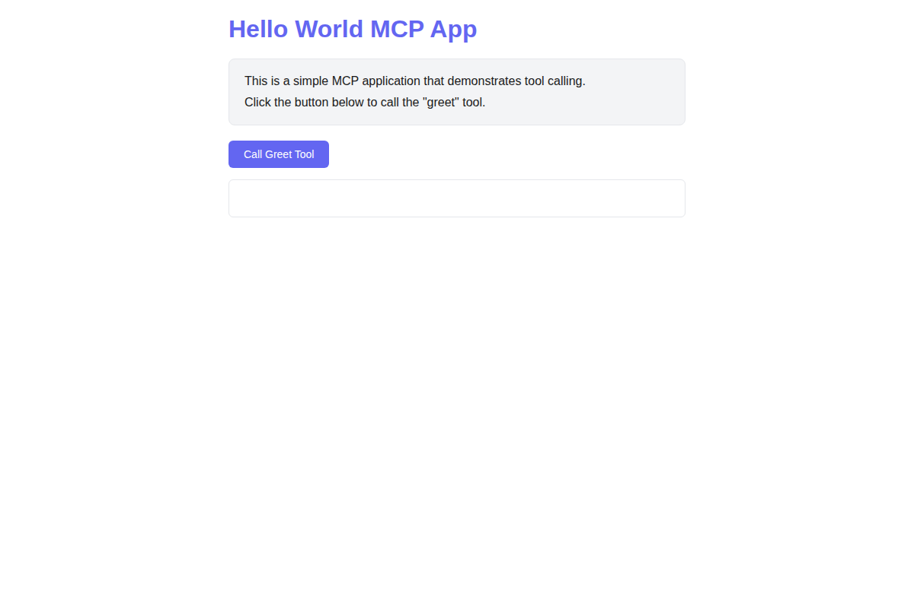
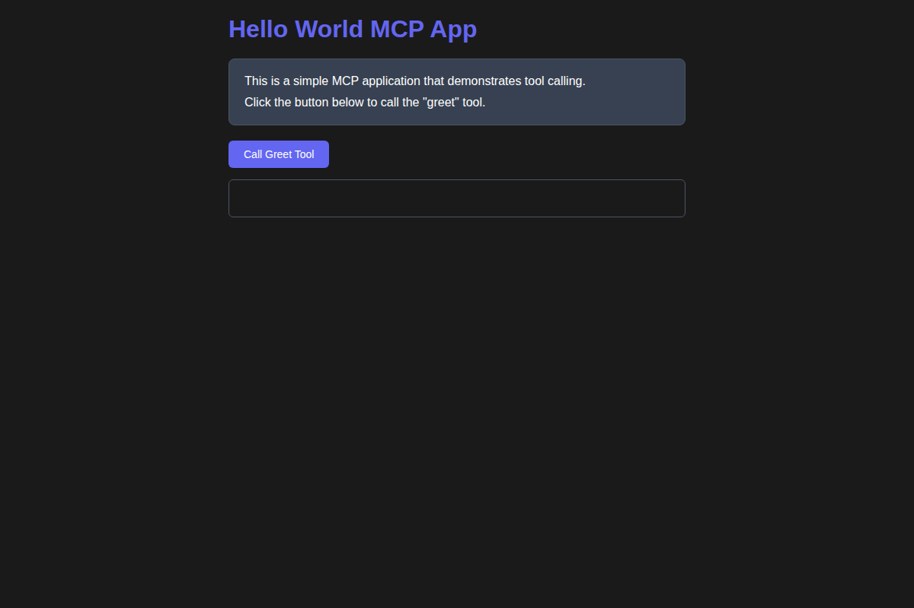

# mcp-apps-testing

The professional UI testing framework for Model Context Protocol (MCP) applications. Validate rendering, sandboxing, and JSON-RPC interactions in a simulated host environment.

## Overview

**mcp-apps-testing** bridges the gap between MCP protocol testing and UI rendering/iframe sandboxing. It provides a comprehensive framework for testing MCP applications with Playwright, enabling you to:

- Simulate IDE environments hosting MCP servers (Claude, VS Code, etc.)
- Mock and intercept JSON-RPC 2.0 messages
- Test MCP protocol interactions without a real server
- Validate UI rendering and sandboxing behavior
- Record and assert message flows
- Test with different host profiles and themes
- Fluent DSL for readable test code

### Example Application

The framework includes a sample "Hello World" MCP application demonstrating UI rendering and tool calling:

**Light Mode:**



**Dark Mode:**



**Tool Call in Action:**


## Quick Start

### Installation

```bash
npm install
npx playwright install chromium
```

### Basic Usage

```typescript
import { test, expect } from '@playwright/test';
import { MockMCPHost } from 'mcp-apps-testing';

test('MCP initialization', async () => {
  // Zero-config setup with Claude profile
  const host = new MockMCPHost({ 
    hostProfile: 'Claude',
    debug: true 
  });
  
  await host.initialize({ name: 'my-app', version: '1.0.0' });
  expect(host.isInitialized()).toBe(true);
  
  await host.cleanup();
});
```

### Fluent DSL Example

```typescript
test('Call tool with auto-retry', async () => {
  const host = new MockMCPHost({ hostProfile: 'Claude' });
  
  // Mock tool response
  host.getInterceptor().mockResponse('tools/call', (req) => ({
    jsonrpc: '2.0',
    id: req.id,
    result: { content: [{ type: 'text', text: 'Success!' }] }
  }));
  
  // Use fluent DSL with automatic retries
  const response = await host.callTool('my-tool', { arg: 'value' }, {
    timeout: 5000,
    retries: 3
  });
  
  expect(response.result.content[0].text).toBe('Success!');
  await host.cleanup();
});
```

## Architecture

The framework consists of three main components that work together to provide comprehensive MCP application testing:


### Core Components

1. **MockMCPHost** - Simulates an IDE environment hosting an MCP server
   - Handles common MCP protocol messages automatically
   - Supports capability configuration
   - Provides request/response simulation
   - **NEW:** Fluent DSL methods with auto-retry
   - **NEW:** Host profile simulation

2. **TransportInterceptor** - Intercepts and mocks JSON-RPC messages
   - Request/response interception and modification
   - Method-specific response mocking
   - Complete message recording for assertions

3. **Host Profiles** - Pre-configured host environments
   - Claude AI profile with theme variables
   - VS Code profile with constraints
   - Generic profile for custom hosts

### Project Structure

```
mcp-apps-testing/
├── src/              # Framework engine
│   ├── core/         # Core classes (MockMCPHost, TransportInterceptor, HostProfiles)
│   ├── types/        # TypeScript type definitions
│   └── index.ts      # Main exports
├── examples/         # Sample tests
│   ├── basic-test.spec.ts        # Basic framework tests
│   ├── hello-world.spec.ts       # Complete example with UI
│   └── hello-world-app.html      # Sample MCP app
├── docs/             # Documentation
├── dist/             # Built output (generated)
└── playwright.config.ts
```

## Key Features

### Automatic Protocol Handling

The framework automatically responds to common MCP protocol messages:
- `initialize` - Connection initialization with capability negotiation
- `ping` - Keep-alive messages
- `tools/list` - List available tools
- `resources/list` - List available resources
- `prompts/list` - List available prompts

### Fluent DSL Methods

Human-readable methods for common operations:

```typescript
const host = new MockMCPHost({ hostProfile: 'Claude' });

// Call a tool with auto-retry
await host.callTool('my-tool', { arg: 'value' }, { timeout: 5000, retries: 3 });

// List tools
await host.listTools();

// Read a resource
await host.readResource('file:///path/to/resource');

// Get a prompt
await host.getPrompt('my-prompt', { arg: 'value' });

// List resources and prompts
await host.listResources();
await host.listPrompts();
```

### Host Profile Simulation

Test against different AI host environments:

```typescript
import { MockMCPHost, HostProfiles, applyTheme } from 'mcp-apps-testing';

// Use Claude profile
const host = new MockMCPHost({ hostProfile: 'Claude' });
const profile = host.getHostProfile();
console.log(profile.name); // 'Claude'
console.log(profile.capabilities); // { tools: { listChanged: true }, ... }

// Apply theme to UI tests
const themeCSS = applyTheme(HostProfiles.Claude, 'dark');
await page.addStyleTag({ content: `:root { ${themeCSS} }` });
```

Available profiles:
- **Claude**: Anthropic's Claude AI with full capabilities
- **VSCode**: VS Code with editor-specific constraints
- **Generic**: Default profile for custom hosts

### Custom Response Mocking

```typescript
const interceptor = host.getInterceptor();

interceptor.mockResponse('tools/call', (request) => ({
  jsonrpc: '2.0',
  id: request.id,
  result: {
    content: [{ type: 'text', text: 'Mocked tool result' }],
  },
}));
```

### Message Interception

```typescript
// Intercept all outgoing requests
interceptor.onRequest(async (request) => {
  console.log('Request:', request.method);
  return request;  // Can modify before returning
});

// Intercept all incoming responses
interceptor.onResponse(async (response) => {
  console.log('Response:', response);
  return response;  // Can modify before returning
});
```

### Protocol Logging

Enable detailed logging for debugging:

```typescript
const host = new MockMCPHost({ debug: true });

// Or enable later
host.enableProtocolLogging();

// Now all JSON-RPC messages will be logged to console
await host.initialize();
// [MCP Request] { "jsonrpc": "2.0", "method": "initialize", ... }
// [MCP Response] { "jsonrpc": "2.0", "result": { ... } }
```

### Message Recording and Assertions

```typescript
// Send some requests
await host.initialize();
await host.sendRequest('tools/list');

// Get recorded messages
const requests = interceptor.getRecordedRequests();
expect(requests).toHaveLength(2);
expect(requests[0].method).toBe('initialize');

// Find specific messages
const toolRequests = interceptor.findRequestsByMethod('tools/list');
expect(toolRequests).toHaveLength(1);
```

## Configuration

### MockMCPHost Options

```typescript
const host = new MockMCPHost({
  autoRespond: true,     // Auto-respond to common protocol messages
  debug: true,           // Enable verbose logging
  hostProfile: 'Claude', // Simulate a specific host environment
});
```

### Capability Configuration

```typescript
host.setCapabilities({
  tools: { listChanged: true },
  resources: { subscribe: true, listChanged: true },
  prompts: { listChanged: true },
});
```

### Playwright Configuration

The framework comes with enhanced Playwright configuration:
- **Trace Viewer**: Automatically enabled on test failures
- **Screenshots**: Captured on failure
- **Video Recording**: Available on failures for debugging
- **Extended Timeouts**: 10s for async operations

## Documentation

- [Getting Started Guide](docs/getting-started.md)
- [API Reference](docs/api-reference.md)
- [Hello World Example](examples/hello-world.spec.ts)

## Running Tests

```bash
# Run all tests
npm test

# Run with Playwright UI mode
npm run test:ui

# Build the framework
npm run build

# Development mode with watch
npm run dev

# View test trace after failure
npx playwright show-trace test-results/<trace-file>.zip
```

### Test Results Example

The framework provides comprehensive test coverage with detailed output:


## Testing UI with Different Themes

```typescript
test('test with Claude dark theme', async ({ page }) => {
  await page.goto('file:///path/to/app.html');
  
  // Apply Claude dark theme
  const themeCSS = applyTheme(HostProfiles.Claude, 'dark');
  await page.addStyleTag({ content: `:root { ${themeCSS} }` });
  
  // Your UI tests here
  await expect(page.locator('h1')).toBeVisible();
});
```

## Tech Stack

- **TypeScript** - Type-safe framework development
- **Playwright** - UI testing and browser automation
- **@modelcontextprotocol/sdk** - MCP protocol implementation

## Package Scripts

- `npm run build` - Compile TypeScript to JavaScript
- `npm run dev` - Watch mode for development
- `npm test` - Run Playwright tests
- `npm run test:ui` - Run tests with Playwright UI
- `npm run clean` - Remove build artifacts

## What's New

### Developer Experience
- **Fluent DSL**: Human-readable methods like `callTool()`, `listTools()`, `readResource()`
- **Auto-Retry**: Configurable retry logic with timeout support
- **Zero-Config**: Works immediately with sensible defaults

### Cross-Host Compatibility
- **Host Profiles**: Pre-configured profiles for Claude, VS Code
- **Theme Variables**: CSS variables for light/dark mode testing
- **Constraints**: Viewport and protocol constraints per host

### Observability
- **Protocol Logging**: Detailed JSON-RPC message logging
- **Trace Viewer**: Playwright trace integration
- **Screenshots & Video**: Automatic capture on failures

### Examples
- **Hello World App**: Complete example with HTML UI
- **Comprehensive Tests**: 16 passing tests demonstrating all features

## Contributing

This is a professional framework designed for MCP UI application testing. Contributions should maintain the modular, extensible architecture and focus on the core testing capabilities.

## License

MIT

## Related Projects

- [Model Context Protocol](https://modelcontextprotocol.io/) - Official MCP specification
- [Playwright](https://playwright.dev/) - Browser testing framework
- [@modelcontextprotocol/sdk](https://github.com/modelcontextprotocol/typescript-sdk) - MCP TypeScript SDK
