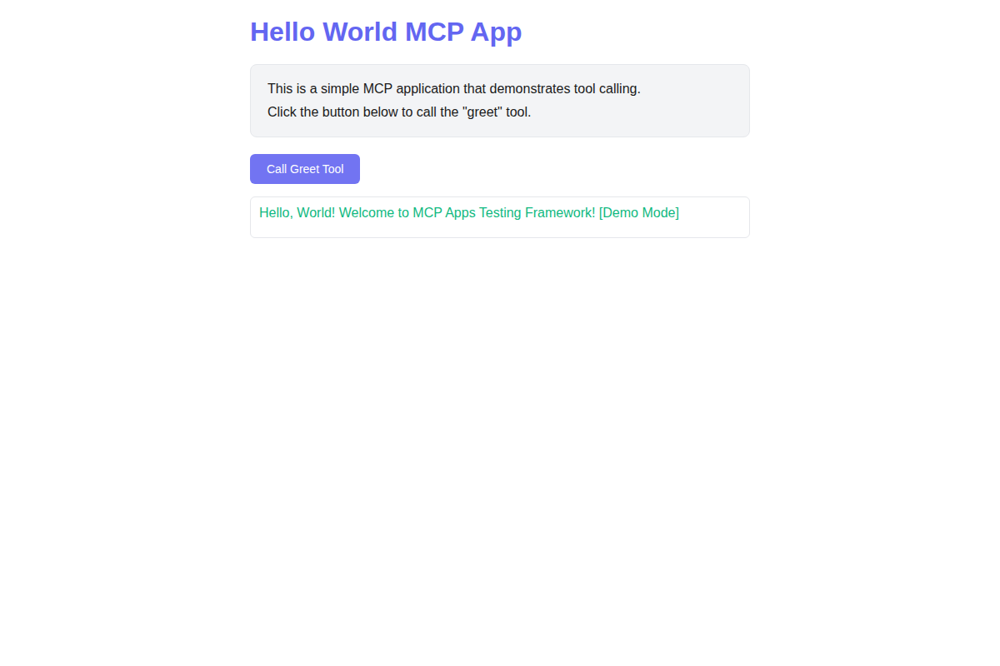
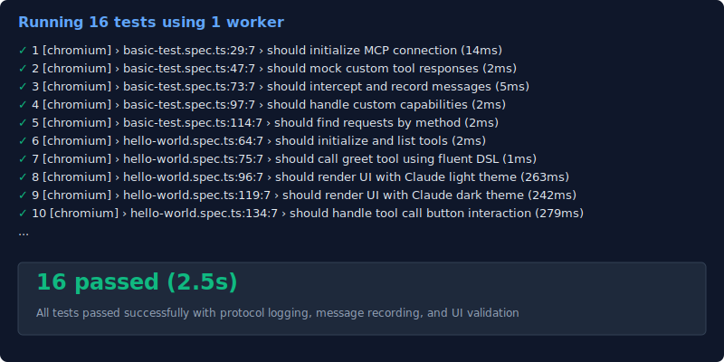

# mcp-apps-testing

**The first UI testing framework built specifically for Model Context Protocol applications.** Test your MCP apps exactly how users experience them—with real browser rendering, simulated IDE environments, and complete JSON-RPC message control.



## Why mcp-apps-testing?

Building MCP applications? You need to test more than just the protocol—you need to verify UI rendering, sandboxing behavior, and real-world interactions across different host environments (Claude, VS Code, etc.). **This is the framework that does all three.**

**Zero-Config Testing**
```typescript
const host = new MockMCPHost({ hostProfile: 'Claude' });
await host.callTool('greet', { name: 'World' });
```

**What Makes It Unique**
- **Host Simulation**: Test against Claude, VS Code, or custom IDE profiles with different capabilities and themes
- **Full Control**: Mock, intercept, and assert on every JSON-RPC message
- **UI + Protocol**: Tests both UI rendering AND protocol interactions in a single framework
- **Fluent API**: Human-readable test code with auto-retry and intelligent defaults

## Quick Start

### Installation

Install the package along with its peer dependency:

```bash
npm install mcp-apps-testing @playwright/test --save-dev
npx playwright install chromium
```

**Write Your First Test**
```typescript
import { test, expect } from '@playwright/test';
import { MockMCPHost } from 'mcp-apps-testing';

test('MCP app responds to tool calls', async () => {
  const host = new MockMCPHost({ hostProfile: 'Claude' });
  
  // Mock the tool response
  host.getInterceptor().mockResponse('tools/call', (req) => ({
    jsonrpc: '2.0',
    id: req.id,
    result: { content: [{ type: 'text', text: 'Hello, World!' }] }
  }));
  
  // Call the tool with fluent API
  const response = await host.callTool('greet', { name: 'World' });
  expect(response.result.content[0].text).toBe('Hello, World!');
  
  await host.cleanup();
});
```

**Run tests**: `npm test`

## Key Features

### Simulate Real IDE Environments
Test your MCP app against different host profiles with specific capabilities, themes, and constraints:
```typescript
new MockMCPHost({ hostProfile: 'Claude' })  // Full MCP capabilities
new MockMCPHost({ hostProfile: 'VSCode' })  // Editor-specific constraints
```

### Complete Message Control
Mock, intercept, and record every JSON-RPC interaction:
```typescript
// Mock responses
host.getInterceptor().mockResponse('tools/call', yourHandler);

// Record and assert
const requests = host.getInterceptor().getRecordedRequests();
expect(requests[0].method).toBe('initialize');
```

### Test UI + Protocol Together
Validate both visual rendering AND protocol behavior in the same test:
```typescript
// Test UI rendering
await page.goto('your-mcp-app.html');
await expect(page.locator('h1')).toBeVisible();

// Test protocol interaction  
const response = await host.callTool('greet', { name: 'Test' });
```

## Architecture


**Core Components**
- **MockMCPHost**: Simulates IDE hosting environment with auto-response to common protocol messages
- **TransportInterceptor**: Mocks and records JSON-RPC messages for testing and assertions
- **Host Profiles**: Pre-configured environments (Claude, VS Code, Generic) with capabilities and themes

## Examples

See the [examples/](examples/) directory for complete working examples:
- **hello-world.spec.ts**: Full UI testing with theme switching and tool calls
- **basic-test.spec.ts**: Protocol-focused testing with message mocking



## Documentation

- [Getting Started Guide](docs/getting-started.md) - Detailed setup and first steps
- [API Reference](docs/api-reference.md) - Complete API documentation
- [Example App](examples/hello-world-app.html) - Sample MCP application

## Commands

```bash
npm test              # Run all tests
npm run test:ui       # Run with Playwright UI
npm run build         # Build the framework
npm run dev           # Development mode with watch
```

## Publishing

This package is automatically published to npm via GitHub Actions when a new release is created.

### Publishing a New Version

1. Update the version in `package.json` following [semantic versioning](https://semver.org/)
2. Commit and push the version change
3. Create a new GitHub release with a tag matching the version (e.g., `v0.1.0`)
4. The GitHub Actions workflow will automatically:
   - Build the package
   - Run tests
   - Publish to npm using the `NPM_TOKEN` secret

### Manual Publishing (if needed)

To publish manually:
```bash
npm run build
npm test
npm publish
```

The `prepublishOnly` script ensures a clean build is created before publishing.

## Contributing

This framework is designed for professional MCP UI application testing. Contributions should maintain the modular architecture and focus on core testing capabilities.

## License

MIT

---

**Built with:** TypeScript • Playwright • [@modelcontextprotocol/sdk](https://github.com/modelcontextprotocol/typescript-sdk)

**Learn more:** [Model Context Protocol](https://modelcontextprotocol.io/) • [Playwright](https://playwright.dev/)
