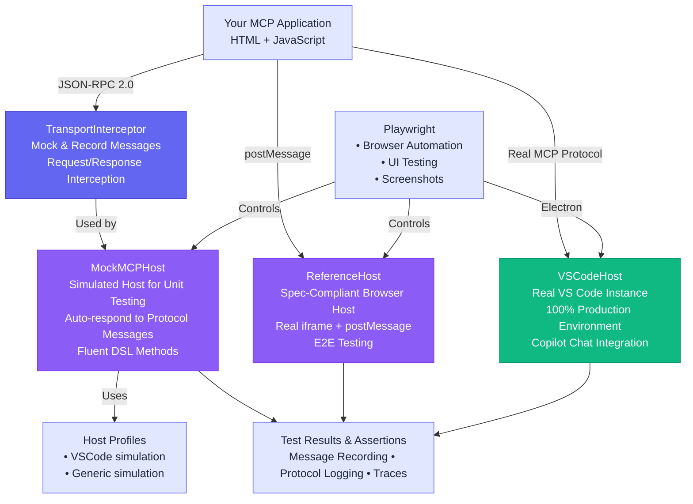

# mcp-apps-testing

[](https://www.npmjs.com/package/mcp-apps-testing)
[](https://www.npmjs.com/package/mcp-apps-testing)
[](https://opensource.org/licenses/MIT)
[](https://nodejs.org)
[](https://www.typescriptlang.org/)

mcp-apps-testing is a testing framework for MCP Apps external UI (ext-apps). It provides tools for testing MCP app UI rendering, iframe sandbox behavior, and postMessage protocol communication. The framework includes mock host environments for unit testing, a spec-compliant reference implementation for E2E browser testing, and real VS Code integration for testing in production environments.

> **Note on Host Support**: This framework provides **simulated host profiles** (VSCode, Claude-like, Generic) for unit testing via `MockMCPHost`. These are NOT connections to real Claude Desktop or other IDEs. For real environment testing, use `VSCodeHost` (real VS Code via Playwright Electron) or `ReferenceHost` (spec-compliant browser implementation).


## Table of Contents

- [Why mcp-apps-testing?](#why-mcp-apps-testing)
- [Quick Start](#quick-start)
  - [Installation](#installation)
- [Key Features](#key-features)
- [Architecture](#architecture)
- [Examples](#examples)
- [Documentation](#documentation)
- [Commands](#commands)
- [Publishing](#publishing)
- [Contributing](#contributing)
- [License](#license)

## Why mcp-apps-testing?

Building MCP applications? You need to test more than just the protocol—you need to verify UI rendering, sandboxing behavior, and host communication. **This framework provides three testing approaches: unit testing with mocks, browser-based E2E testing with a reference implementation, and real VS Code integration testing.**

**Zero-Config Unit Testing**
```typescript
const host = new MockMCPHost({ hostProfile: 'VSCode' });
await host.callTool('greet', { name: 'World' });
```

**What Makes It Unique**
- **Mock Host Profiles**: Unit test with simulated host profiles (VSCode, Generic) that provide different capabilities and themes
- **Full Control**: Mock, intercept, and assert on every JSON-RPC message
- **Reference Implementation**: Browser-based E2E testing with a spec-compliant MCP ext-app host (ReferenceHost)
- **Real VS Code E2E**: Test MCP tools through Copilot Chat in a real VS Code instance with Playwright Electron (VSCodeHost)
- **Fluent API**: Human-readable test code with auto-retry and intelligent defaults

## Quick Start

### Installation

Install the package along with its peer dependency:

```bash
npm install mcp-apps-testing @playwright/test --save-dev
npx playwright install chromium
```

**Write Your First Test**
```typescript
import { test, expect } from '@playwright/test';
import { MockMCPHost } from 'mcp-apps-testing';

test('MCP app responds to tool calls', async () => {
  const host = new MockMCPHost({ hostProfile: 'VSCode' });
  
  // Mock the tool response
  host.getInterceptor().mockResponse('tools/call', (req) => ({
    jsonrpc: '2.0',
    id: req.id,
    result: { content: [{ type: 'text', text: 'Hello, World!' }] }
  }));
  
  // Call the tool with fluent API
  const response = await host.callTool('greet', { name: 'World' });
  expect(response.result.content[0].text).toBe('Hello, World!');
  
  await host.cleanup();
});
```

**Run tests**: `npm test`

## Key Features

### Mock Host Profiles for Unit Testing
Test your MCP app with simulated host environments that provide different capabilities and themes:
```typescript
new MockMCPHost({ hostProfile: 'VSCode' })  // Simulates VS Code-like environment
new MockMCPHost({ hostProfile: 'Generic' })  // Generic MCP host simulation
```

Note: These are **simulated profiles for unit testing**, not connections to real hosts. For real VS Code testing, use `VSCodeHost`.

### Complete Message Control
Mock, intercept, and record every JSON-RPC interaction:
```typescript
// Mock responses
host.getInterceptor().mockResponse('tools/call', yourHandler);

// Record and assert
const requests = host.getInterceptor().getRecordedRequests();
expect(requests[0].method).toBe('initialize');
```

### Test UI + Protocol Together
Validate both visual rendering AND protocol behavior in the same test:
```typescript
// Test UI rendering in browser with ReferenceHost
const host = await ReferenceHost.launch(page, 'your-mcp-app.html');
const frame = host.getAppFrame();
await expect(frame.locator('h1')).toBeVisible();

// Test protocol interaction  
await host.sendMessage({ jsonrpc: '2.0', id: 1, result: { greeting: 'Hello' } });
```

## Architecture



**Core Components**
- **MockMCPHost**: Simulated MCP host for unit testing with auto-response to common protocol messages. Use host profiles (VSCode, Generic) to test with different capabilities and themes.
- **TransportInterceptor**: Mocks and records JSON-RPC messages for testing and assertions
- **Host Profiles**: Pre-configured simulated environments (VSCode, Generic) with capabilities and themes for unit testing
- **ReferenceHost**: Spec-compliant browser-based MCP ext-app host for E2E testing. Implements the postMessage protocol in a real browser with iframe sandboxing.
- **VSCodeHost**: Real VS Code E2E testing via Playwright Electron. Launch VS Code, interact with Copilot Chat, and test MCP tools in a 100% production environment.

## Examples

See the [examples/](examples/) directory for complete working examples:
- **hello-world.spec.ts**: Full UI testing with theme switching and tool calls
- **basic-test.spec.ts**: Protocol-focused testing with message mocking
- **vscode-e2e.spec.ts**: VS Code E2E testing — full MCP tool call through Copilot Chat


## Documentation

- [Getting Started Guide](docs/getting-started.md) - Detailed setup and first steps
- [API Reference](docs/api-reference.md) - Complete API documentation
- [VS Code E2E Testing](docs/vscode-e2e-testing.md) - Test MCP ext-apps in real VS Code
- [Example App](examples/hello-world-app.html) - Sample MCP application

## Commands

```bash
npm test              # Run all tests
npm run test:ui       # Run with Playwright UI
npm run build         # Build the framework
npm run dev           # Development mode with watch
```

## Publishing

This package is automatically published to npm via GitHub Actions when a new release is created.

### Publishing a New Version

1. Update the version in `package.json` following [semantic versioning](https://semver.org/)
2. Commit and push the version change
3. Create a new GitHub release with a tag matching the version (e.g., `v0.1.0`)
4. The GitHub Actions workflow will automatically:
   - Build the package
   - Run tests
   - Publish to npm using OIDC Trusted Publishing with provenance

### Manual Publishing (if needed)

To publish manually:
```bash
npm run build
npm test
npm publish
```

The `prepublishOnly` script ensures a clean build is created before publishing.

## Contributing

This framework is designed for professional MCP UI application testing. Contributions should maintain the modular architecture and focus on core testing capabilities.

## License

MIT

---

**Built with:** TypeScript • Playwright

**Learn more:** [Model Context Protocol](https://modelcontextprotocol.io/) • [Playwright](https://playwright.dev/)
